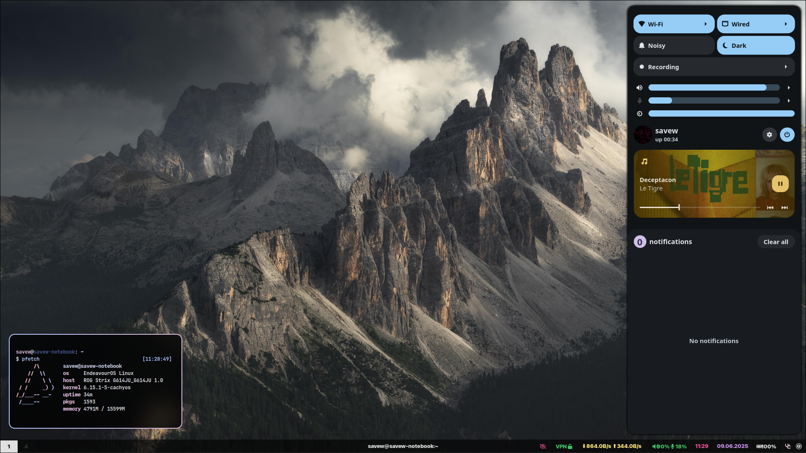

This is my personal repo for my dotfiles.

# Dependencies

| Type            | Package(s)                                           |
| --------------- | ---------------------------------------------------- |
| WM              | `hyprland`                                           |
| Bar             | `waybar`                                             |
| Launcher        | `rofi`                                               |
| Notifications   | `ignis`                                              |
| Terminal        | `alacritty`                                          |
| Cursor          | `bibata`                                             |
| File manager    | `pcmanfm-qt`                                         |
| Screenshot tool | `flameshot`                                          |
| Fonts           | `ttf-iosevka-nerd ttf-jetbrains-mono monaspace Neon` |
| Editor          | `neovim`                                             |

# Installation

This repo includes a setup script to automate installation and configuration.

## Automated Setup Script

Run the install script to:

* Detect if your system is Arch-based
* Install or detect AUR helper (`yay` or `paru`)
* Download and install packages from a remote list
* Initialize and apply dotfiles via `chezmoi`
* Download and install fonts with fallback handling
* Choose between two dotfiles repositories (Save's Dots or Jomo's Dots)

### Usage

Download and run the script:

```bash
curl -LO https://raw.githubusercontent.com/saveside/dots/main/install.sh
chmod +x install.sh
sudo ./install.sh
```

During execution, you'll be prompted to choose between:

```
Choices:
1.) Save's Dots (default)
2.) Jomo's Dots (for testing and other reasons)
Enter choice [1/2]:
```

Press Enter to select the default (Save's Dots).

---

## Manual Installation (if preferred)

```bash
chezmoi init https://github.com/saveside/dots
chezmoi apply -v

# Install SF Pro font
mkdir -p ~/.fonts
wget https://files.savew.dev/sf-pro.zip
bsdtar -xf sf-pro.zip -C ~/.fonts
fc-cache -frv
rm sf-pro.zip
```

# Keyboard Shortcuts

| Shortcut               | Action                             |
| ---------------------- | ---------------------------------- |
| Super + Return (Enter) | Launch terminal (`alacritty`)      |
| Super + E              | Launch file manager (`pcmanfm-qt`) |
| Super + Q              | Launch web browser (`zen-browser`) |
| Super + Shift + C      | Close focused application          |
| Super + Shift + R      | Restart window manager             |
| Super + R              | Start program launcher (`rofi`)    |
| Super + 1-9            | Switch workspaces from 1 to 9      |

# Screenshots



