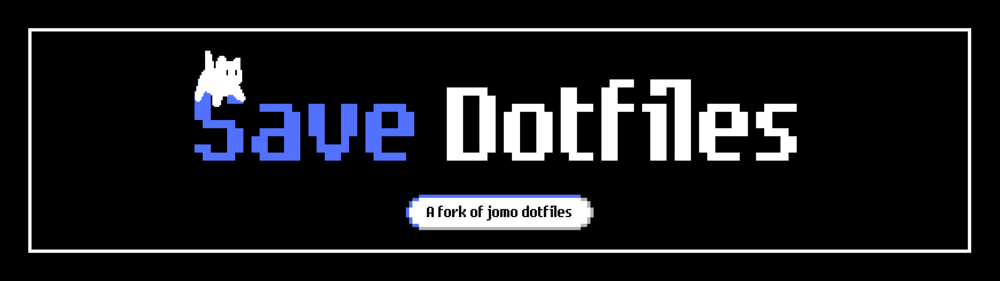

This is my personal repo for my dotfiles.

# Dependencies

| Type            | Package(s)                                           |
| --------------- | ---------------------------------------------------- |
| WM              | `hyprland`                                           |
| Bar             | `waybar`                                             |
| Launcher        | `rofi`                                               |
| Notifications   | `ignis`                                              |
| Terminal        | `alacritty`                                          |
| Cursor          | `bibata`                                             |
| File manager    | `pcmanfm-qt`                                         |
| Screenshot tool | `flameshot`                                          |
| Fonts           | `ttf-iosevka-nerd ttf-jetbrains-mono monaspace Neon` |
| Editor          | `neovim`                                             |

You can also use `yay -S --needed - < pkgs` to install all dependencies.

# Installation

Incomplete but should get you most things.

```bash
chezmoi init https://github.com/saveside/dots
chezmoi apply -v
# Optional if you want to get san francisco pro font
mkdir -p ~/.fonts
wget https://github.com/githubnext/monaspace/releases/download/v1.000/monaspace-v1.000.zip && unzip monaspace-v1.000.zip -d ~/.fonts
fc-cache -frv
rm -rf "monaspace-v1.000.zip"
```

# Some shortcuts

| Shortcut               | Action                             |
| ---------------------- | ---------------------------------- |
| Super + Return (enter) | Launch terminal (`alacritty`)      |
| Super + E              | Launch file manager (`pcmanfm-qt`) |
| Super + Q              | Launch web browser (`zen-browser`) |
| Super + Shift + C      | Close focused application          |
| Super + Shift + R      | Restart window manager             |
| Super + Shift + Q      | Quit window manager                |
| Super + R              | Start program launcher (`rofi`)    |
| Super + 1-9            | Switch workspaces from 1 to 9      |

# Screenshots


